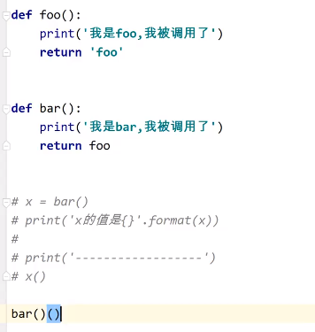

# python 函数

只用函数能够分割作用于

global对变量进行声明；则可以在局部作用内访问到全局变量 

globals() 和locals() 获取全局、局部变量

## 参数

默认参数：

​		缺省参数只能放在后面；

​		如果有位置参数和关键字参数时，关键字必须放在未知参数后面；

​		如果只有关键字参数时；顺序不影响

可变参数：

​		*args 可变的位置参数

​		**kwargs 可变的关键字参数

## 匿名函数

除了使用def 关键字定义函数外，还可以使用 lambda表达式定义一个函数 

调用匿名函数的两种方式

​		1、定义一个别名

​		2、把匿名函数当做参数传给另一个函数使用（广泛使用）

```python
# lambda 参数: 表达式
lambda a, b: a + b
```

## 高阶函数

1. 一个函数作为另一函数的参数

   匿名函数 lambda

2. 一个函数作为另一个函数的返回值

   

3. 函数内部再定一个函数

   

### 闭包


## 装饰器


## 常用的内置函数

### sort

```python
list= [4, 2, 8, 1]
list.sort(); # [1, 2, 4, 8]
new_list = sorted(list) # [1, 2, 4, 8] list 不变
# list里有字典要排序时  sort()可以传递一个函数类型的参数;参数名为key 返回字典排序的key对应的value
person = [
    {"name": "zs", "age": 18},
    {"name": "ls", "age": 12},
    {"name": "ww", "age": 23}
]
person.sort(key = lambda item: item["age"])
```

## 常用的内置类

### filter

```python
# py2中是一个内置函数 py3中是一个内置类
# filter有两个参数；一个是 过滤函数； 一个是 可迭代对象
# 返回一个可迭代的对象
ages = [19, 15, 20, 25, 13]
not_18 = ages.filter(lambda age: age < 18, ages)
for i in not_18:
    print(i) # 15 13
```

### map

```python
# 遍历可迭代对象 对对象中每个元素进行操作
ages = [19, 15, 20, 25, 13]
new_ages = ages.map(lambda item： item + 2， ages)
print(list(new_ages)) # [21, 17, 22, 27, 15]
```

### reduce

```python
from functools import reduce# 减项
ages = [19, 15, 20, 25, 13]
# 首先x=19, y=15； 相加34
# 然后x=34  y=20
reduce(lambda x, y: x + y, ages)

person = [
    {"name": "zs", "age": 18},
    {"name": "ls", "age": 19},
    {"name": "ww", "age": 15}
]
# reduce的第三个参数为初始值 他将替代前一个计算的值
print(reduce(lambda x, y: x + y["age"], person, 0))
```

